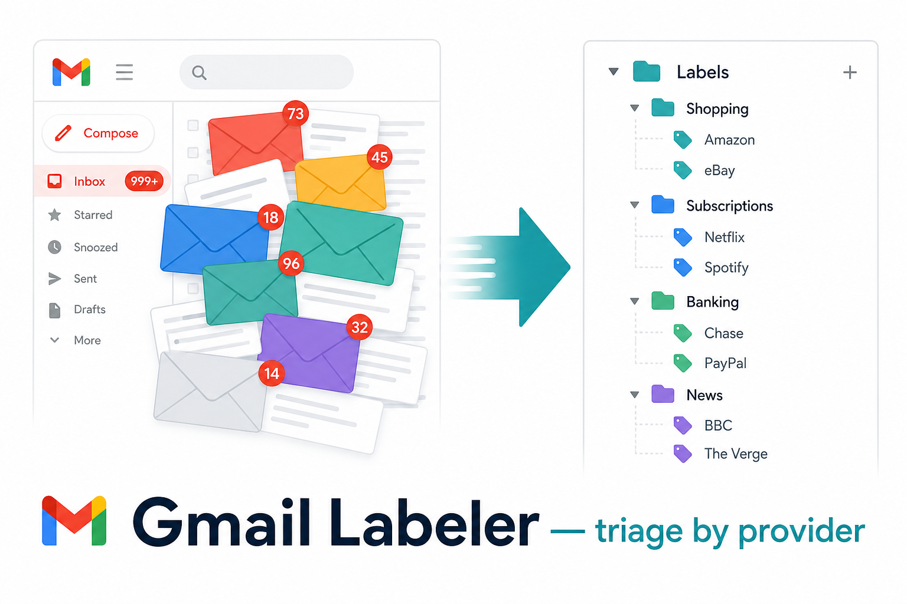
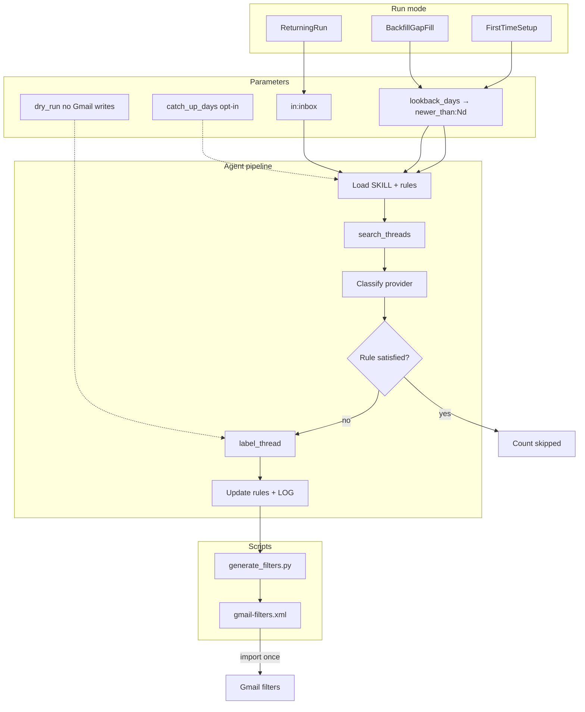

<p align="left">
  <a href="https://buymeacoffee.com/rnlkja"></a>
  <a href="https://www.gnu.org/licenses/gpl-3.0"></a>
</p>


<h1 align='center'>Gmail Labeler</h1>

<p align="center"><strong>Triage your Gmail by provider, with importable filters.</strong></p>

<p align="center">
  
</p>

<p align="center">
  <a href="https://buymeacoffee.com/rnlkja">
    
  </a>
</p>

<!-- > **Sponsor on GitHub:** use the **Sponsor** button (heart icon) on the repo homepage. It links to [buymeacoffee.com/rnlkja](https://buymeacoffee.com/rnlkja) via [`.github/FUNDING.yml`](.github/FUNDING.yml). -->

## About Gmail Labeler

Gmail Labeler is an agent skill for [Cursor](https://cursor.com), [Claude](https://claude.ai), and [Codex](https://developers.openai.com/codex/) that files your mail by the company or service that sent it. Newsletters, receipts, subscription renewals, bank alerts, and grocery confirmations each land under a nested label (for example `Shopping/Amazon`, `Subscriptions/Spotify`, or `Banking/PayPal`). What stays in your inbox, by design, is the mail that actually needs you: a bill due this week, a government notice, or a message from a real person.

The skill runs through a Gmail MCP connector. Your agent reads sender addresses, subjects, and snippets, matches them to a label taxonomy you control, and applies labels in bulk. Receipts and account records stay visible. Marketing and digests get labelled and archived so they remain searchable without cluttering the inbox. Nothing is deleted. Attachment filenames can be used for context; attachment contents are never opened.

On the first run, the skill scans the **last three months** of mail (default `lookback_days: 90`), **creates master category labels** on demand, builds a sender-to-label map, generates `gmail-filters.xml`, and **skips mail that already satisfies the rule**. Import filters once to label older backlog without the agent re-reading every thread. **Returning runs** triage **inbox only**. Your personal rules live in local files (`MEMORY.md`, `provider-rules.md`, `LOG.md`) that never leave your machine.

## Who this is for

This skill suits you if:

- Your inbox mixes bills, newsletters, order confirmations, and job alerts in one unread pile.
- You already use labels in Gmail (or want to) and prefer filing by provider rather than by date alone.
- You run an AI coding agent with MCP and want repeatable email triage without manual filter setup for every new sender.
- You want a starter rule set (~100 globally recognised brands) that you can customise for your own mailbox.

If you only receive a handful of emails per week and never use labels, manual Gmail filters may be enough. Gmail Labeler pays off when volume is high and senders repeat.

## What you get out of the box

| Deliverable | What it does |
|---|---|
| `SKILL.md` | Step-by-step method the agent follows on every run |
| `references/provider-rules.template.md` | Starter sender-to-label table across banking, grocery, subscriptions, travel, bills, and more |
| `references/email-policy.md` | Category actions (keep, archive, notify, skip) and safety rules |
| `examples/prompts/` | Copy-paste prompts for first-time setup, weekly inbox triage, backfill, dry runs, fix-wrong-labels |
| `examples/scheduling/` | launchd, cron, and GitHub Actions templates for Sunday triage |
| `scripts/generate_filters.py` | Deterministic `gmail-filters.xml` generator |
| Generated `gmail-filters.xml` | One Gmail import to label existing mail and auto-file future mail |

After setup, a typical inbox drops from hundreds of unread threads to a short list of actionable items, with everything else filed under organised labels in the sidebar.

## How it works



**First-time setup** scans mail within `lookback_days` (default **90** — three months), creates master labels **on demand**, builds a sender-to-label map, and runs `scripts/generate_filters.py`. Import filters to handle older mail without a long agent scan. **Returning runs** process **inbox only** with rule-satisfied skip. See [VERSION.md](VERSION.md).

## Core behaviour

- **Labels mail by provider.** Every recognisable sender gets a nested label (`Shopping/Amazon`, `Subscriptions/Spotify`, `Banking/PayPal`, and so on).
- **Keeps records, archives noise.** Receipts, bills, and government mail stay in the inbox. Newsletters and promos are labelled then archived.
- **Generates importable Gmail filters** via `scripts/generate_filters.py` — re-import when rules change.
- **Parameterised lookback.** Default three months (`lookback_days: 90`). Widen only when you need older history.
- **Token-efficient by design.** Snippet-only classification, rule-satisfied skip, filters for bulk backlog — see SKILL.md § Token efficiency.
- **Learns over time.** New senders go in `provider-rules.md`; precedents in `MEMORY.md`; every run logged in `LOG.md`.

## What your Gmail looks like after

**Before:**

```text
INBOX (1,247 unread)
  Spotify Family Plan renewal notice
  TLDR: "5 stories from your day"
  AGL Energy bill is due in 5 days
  Amazon: Your order has shipped
  Booking.com: 30% off your next stay
  ATO: Notice of assessment
  Patreon: Weekly digest from 4 creators
  GitHub: 12 notifications
  ... (1,239 more)
```

Everything competes with everything. The bill and the tax notice sit next to a sale
promo and a digest.

**After:**

```text
INBOX (3)
  AGL Energy bill is due in 5 days       (kept, actionable)
  ATO: Notice of assessment              (kept, government record)
  Mum: dinner Sunday?                    (kept, personal)

Labels (sidebar):
  Banking/
    PayPal, Chase, CommBank, Wise, …
  Bills/
    AGL, Telstra, Optus, …
  Government/
    ATO, Services NSW, ImmiAccount, …
  Shopping/
    Amazon, eBay, Apple, IKEA, …
  Subscriptions/
    Spotify, Netflix, Notion, GitHub, …
  News & Ads/                            (auto-archived)
    TLDR, Morning Brew, Substack, …
  Travel/
    Qantas, Booking.com, Airbnb, …
  Health/
    Bupa, Chemist Warehouse, …
  Career/
    LinkedIn, Seek, …
```

Everything labelled, marketing pre-archived (still searchable, just out of the
way), receipts and bills kept in the inbox as records, and the inbox itself
collapses to the handful of things that actually need you.

## Prerequisites

- An AI agent that loads **skills** and connects to **Gmail via MCP**:
  - **Cursor**
  - **Claude** (Code / Desktop)
  - **Codex** (OpenAI CLI / agent)
- The Gmail connector must support: `search_threads`, `list_labels`, `label_thread`,
  `unlabel_thread`, `create_label` (see `SKILL.md` for details)
- **Python 3** for `scripts/generate_filters.py` (stdlib only)

## Gmail MCP setup (about 5 minutes)

1. **Google Cloud OAuth client** — create a Desktop app OAuth client, download JSON keys.
2. **Save keys** to `~/.gmail-mcp/gcp-oauth.keys.json`.
3. **Add MCP server** to your agent config:
   - **Cursor:** `~/.cursor/mcp.json` — package `@gongrzhe/server-gmail-autoauth-mcp`
   - **Claude Code:** `~/.claude/mcp.json` (same package)
4. **Authenticate:** `npx @gongrzhe/server-gmail-autoauth-mcp auth`
5. **Reload MCP** in your agent and verify with `list_labels`.

**Security:** limit MCP access if your inbox holds confidential mail. Consider a
dedicated Gmail account for automation trials.

## Installation

### Cursor (per-user skill)

```bash
git clone https://github.com/rNLKJA/gmail-labeler.git ~/.cursor/skills/gmail-labeler
```

### Claude Code / Desktop

```bash
git clone https://github.com/rNLKJA/gmail-labeler.git ~/.claude/skills/gmail-labeler
```

### Codex (OpenAI CLI)

User-wide (available in every project):

```bash
git clone https://github.com/rNLKJA/gmail-labeler.git ~/.codex/skills/gmail-labeler
```

Or project-scoped (commit into your repo for the team):

```bash
git clone https://github.com/rNLKJA/gmail-labeler.git .codex/skills/gmail-labeler
```

Restart Codex after installing so it picks up the new skill. You can also install
via the built-in skill-installer: *"Install the skill from
github.com/rNLKJA/gmail-labeler"*.

### Standalone

Clone anywhere and point your agent's instructions at the `SKILL.md` path.

### Initialise working files

These files hold your personal data and are git-ignored:

```bash
cd gmail-labeler
cp MEMORY.template.md MEMORY.md
cp LOG.template.md LOG.md
cp references/provider-rules.template.md references/provider-rules.md
```

### Rebuild install package (optional)

After pulling updates:

```bash
./scripts/build-skill.sh
# writes ../email-labeler.skill by default; use --output PATH to override
```

## Parameters

| Parameter | Default | Example scope |
|---|---|---|
| `lookback_days` | **`90`** (3 months) | `newer_than:90d -in:sent -in:chats -in:draft` |
| `catch_up_days` | `7` | `has:nouserlabels newer_than:7d …` (opt-in) |
| `dry_run` | `true` on first scope | No Gmail mutations when true |

Natural language: *"last 3 months"* → `lookback_days: 90`. Widen to `365` only if you need a full year.

### Saving tokens

1. **Keep the default 90-day window** for first-time setup — covers most active senders.
2. **Import `gmail-filters.xml`** with "Apply to existing conversations" so Gmail labels old mail without the agent reading every thread.
3. **Weekly runs use `in:inbox` only** — cheap once filters are in place.
4. **Dry run first** on any new scope before mutating labels.
5. **Backfill with `has:nouserlabels`** instead of re-scanning all mail in a date range.

## Usage — first run

Paste this into your agent:

```text
Run the gmail-labeler skill in first-time setup mode.
lookback_days: 90
Scope: newer_than:90d -in:sent -in:chats -in:draft
Dry run: true
Goal: build my sender→label map (distinct domains first), report, then apply gaps + filters.
```

Expected output: distinct senders, masters on demand, rule-satisfied skip count,
confirmation before any Gmail mutations.

See also: `examples/prompts/first-time-setup.md`

## Usage — recurring runs

Weekly triage prompt:

```text
Run the gmail-labeler skill in returning-run mode.
Scope: in:inbox -in:sent -in:chats -in:draft
Dry run: false
Skip rule-satisfied threads. Only label gaps.
```

**Inbox-zero:** if filters pre-archive everything, zero inbox threads is normal.
Use catch-up only when you ask: `has:nouserlabels newer_than:7d …`

See also: `examples/prompts/weekly-triage.md`, `examples/prompts/fix-wrong-labels.md`

## Scheduling (weekly automation)

Three options — pick one:

| Method | File | When |
|---|---|---|
| macOS launchd | `examples/scheduling/launchd/com.rNLKJA.gmail-labeler.weekly.plist` | Sundays 09:00 local |
| cron | `examples/scheduling/cron/crontab.example` | Sundays 09:00 |
| GitHub Actions | `examples/scheduling/github-actions/weekly-triage.yml` | Sundays 09:00 UTC (advanced) |

Each file notes the assumptions it makes (CLI binary, env vars, MCP endpoint).
You need a working agent CLI (`cursor-agent`, `claude`, `codex`, or equivalent) on PATH.

## Files

| File | Purpose |
|---|---|
| `SKILL.md` | The method — read first by the agent (v1.1.0) |
| `README.md` | This file |
| `VERSION.md` | Feature matrix and current version |
| `CHANGELOG.md` | Release history |
| `LICENSE` | GPL-3.0 |
| `scripts/generate_filters.py` | Rules → `gmail-filters.xml` + `email-receive-rules.md` |
| `scripts/build-skill.sh` | Rebuild `email-labeler.skill` zip |
| `references/email-policy.md` | Category actions and safety rules |
| `references/provider-rules.template.md` | Starter sender→label table (~200 rules) |
| `MEMORY.template.md` | Scaffold for account-specific precedents |
| `LOG.template.md` | Scaffold for run history |
| `examples/prompts/` | First-time, weekly, backfill, dry-run, fix-wrong-labels |
| `examples/scheduling/` | launchd, cron, GitHub Actions templates |

Working copies (`MEMORY.md`, `LOG.md`, `references/provider-rules.md`) are
created locally and git-ignored.

## Security & privacy

### What this skill accesses

This skill reads your email — sender, subject, snippet, body text, label IDs,
and attachment **filenames** — to decide what label to apply. It does **not**
download, open, or read attachment contents. It does **not** send, reply,
forward, or delete mail. It only changes labels (including removing `INBOX` to
archive).

| | Reads | Modifies |
|---|---|---|
| **CAN** | Sender, subject, snippet, body, label IDs, attachment filenames | Add labels, remove INBOX, create labels |
| **MUST NOT** | Attachment contents (PDFs, images, docs) | UNREAD, STARRED, content, recipients; send/reply/delete |

### Local personal data

`MEMORY.md`, `LOG.md`, and the populated `references/provider-rules.md` contain
your personal sender list and precedents. They are listed in `.gitignore` and
never committed. If you fork this repo, keep the same `.gitignore`.

The skill itself only calls your Gmail MCP connector and writes to local files.
Anything beyond that boundary depends on your chosen MCP and agent runtime.

## Customising

- Edit `MEMORY.md` for account-specific precedents (parent taxonomy, keep/archive
  rules, multi-type brand splits).
- Edit `references/provider-rules.md` for your sender→label map (include `Match` for multi-type brands).
- Edit `references/email-policy.md` to adjust category actions.
- Regenerate filters after rule changes:

```bash
python scripts/generate_filters.py references/provider-rules.md --output-dir .
```

Re-import `gmail-filters.xml` in Gmail when the run report says rules changed.

## Contributing

Issues and pull requests welcome. This project is licensed under GPL-3.0 — if you
build on top of it, your derivative work must also be released under GPL-3.0.

## License

GPL-3.0 — Copyright (C) 2026 rNLKJA. See [LICENSE](LICENSE).

If you build on top of this repo, your derivative work must also be released under
GPL-3.0.

## Support

<p align="center">
  <a href="https://buymeacoffee.com/rnlkja">
    
  </a>
</p>

If this skill saves you time, a coffee helps keep it maintained. Visit [buymeacoffee.com/rnlkja](https://buymeacoffee.com/rnlkja) or use the **Sponsor** button on this repo.
