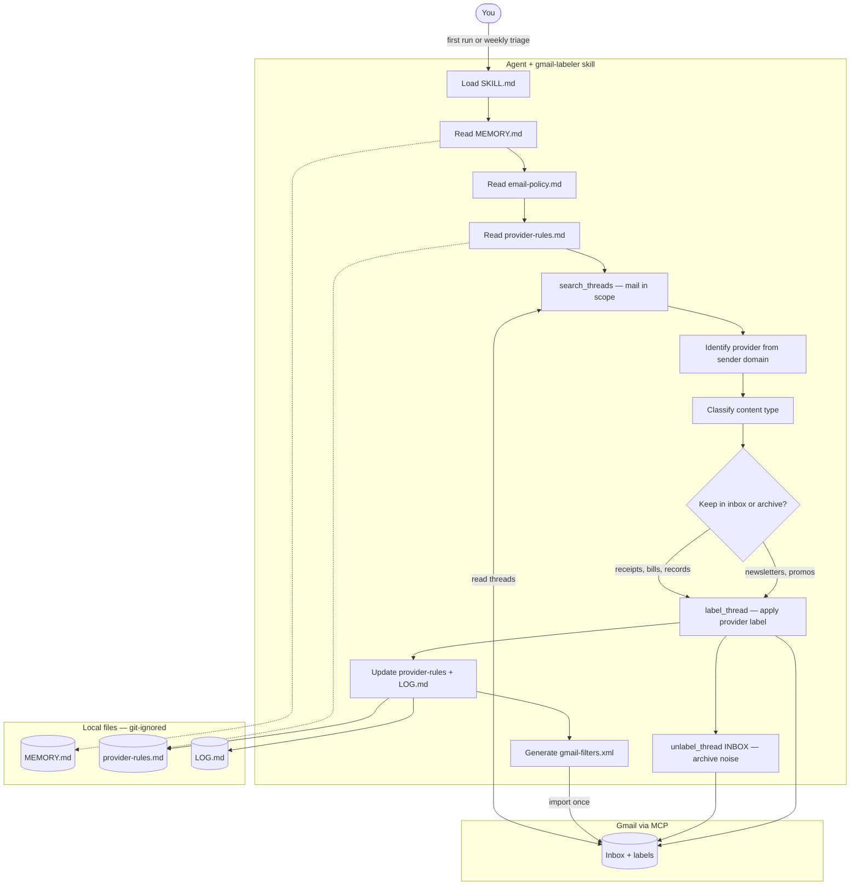

<p align="left">
  <a href="https://buymeacoffee.com/rnlkja"></a>
  <a href="https://www.gnu.org/licenses/gpl-3.0"></a>
</p>


<h1 align='center'>Gmail Labeler</h1>

Triage your Gmail by provider, with importable filters.

<p align="center">
  
</p>

<p align="center">
  <a href="https://buymeacoffee.com/rnlkja">
    
  </a>
</p>


## How it works



**First-time setup** scans the last year of mail, builds a 1:1 sender→label map, creates
labels, and generates importable Gmail filters. **Returning runs** read your saved
rules and only reason from scratch for new senders — typically a weekly 7-day sweep.

## What it does

- **Labels mail by provider** — every recognisable sender gets a nested label
  (Shopping/Amazon, Subscriptions/Spotify, Banking/PayPal, …).
- **Keep vs archive intelligently** — receipts, bills, and government mail stay
  in the inbox; newsletters and promos get labelled then archived.
- **Generates importable Gmail filters** — one import clears the backlog and
  auto-categorises future mail.

## What your Gmail looks like after

**Before:**

```text
INBOX (1,247 unread)
  Spotify Family Plan renewal notice
  TLDR — "5 stories from your day"
  AGL Energy bill is due in 5 days
  Amazon: Your order has shipped
  Booking.com: 30% off your next stay
  ATO — Notice of assessment
  Patreon: Weekly digest from 4 creators
  GitHub: 12 notifications
  ... (1,239 more)
```

Everything competes with everything. The bill and the tax notice sit next to a sale
promo and a digest.

**After:**

```text
INBOX (3)
  AGL Energy bill is due in 5 days       (kept — actionable)
  ATO — Notice of assessment             (kept — government record)
  Mum: dinner Sunday?                    (kept — personal)

Labels (sidebar):
  Banking/
    PayPal, Chase, CommBank, Wise, …
  Bills/
    AGL, Telstra, Optus, …
  Government/
    ATO, Services NSW, ImmiAccount, …
  Shopping/
    Amazon, eBay, Apple, IKEA, …
  Subscriptions/
    Spotify, Netflix, Notion, GitHub, …
  News & Ads/                            (auto-archived)
    TLDR, Morning Brew, Substack, …
  Travel/
    Qantas, Booking.com, Airbnb, …
  Health/
    Bupa, Chemist Warehouse, …
  Career/
    LinkedIn, Seek, …
```

Everything labelled, marketing pre-archived (still searchable, just out of the
way), receipts and bills kept in the inbox as records, and the inbox itself
collapses to the handful of things that actually need you.

## Prerequisites

- An AI agent that loads **skills** and connects to **Gmail via MCP**:
  - **Cursor**
  - **Claude** (Code / Desktop)
  - **Codex** (OpenAI CLI / agent)
- The Gmail connector must support: `search_threads`, `list_labels`, `label_thread`,
  `unlabel_thread`, `create_label` (see `SKILL.md` for details)

## Installation

### Cursor (per-user skill)

```bash
git clone https://github.com/rNLKJA/gmail-labeler.git ~/.cursor/skills/gmail-labeler
```

### Claude Code / Desktop

```bash
git clone https://github.com/rNLKJA/gmail-labeler.git ~/.claude/skills/gmail-labeler
```

### Codex (OpenAI CLI)

User-wide (available in every project):

```bash
git clone https://github.com/rNLKJA/gmail-labeler.git ~/.codex/skills/gmail-labeler
```

Or project-scoped (commit into your repo for the team):

```bash
git clone https://github.com/rNLKJA/gmail-labeler.git .codex/skills/gmail-labeler
```

Restart Codex after installing so it picks up the new skill. You can also install
via the built-in skill-installer: *"Install the skill from
github.com/rNLKJA/gmail-labeler"*.

### Standalone

Clone anywhere and point your agent's instructions at the `SKILL.md` path.

### Initialise working files

These files hold your personal data and are git-ignored:

```bash
cd gmail-labeler
cp MEMORY.template.md MEMORY.md
cp LOG.template.md LOG.md
cp references/provider-rules.template.md references/provider-rules.md
```

## Usage — first run

Paste this into your agent:

```text
Run the gmail-labeler skill in first-time setup mode.
Scope: newer_than:1y -in:sent -in:chats -in:draft
Dry run: true
Goal: build my 1:1 sender→label map and report it before applying.
```

Expected output: a report of distinct senders, proposed labels grouped by parent,
and a confirmation prompt before applying.

See also: `examples/prompts/first-time-setup.md`

## Usage — recurring runs

Weekly triage prompt:

```text
Run the gmail-labeler skill in returning-run mode.
Scope: newer_than:7d
Apply existing rules from references/provider-rules.md; only reason from scratch for new senders.
```

See also: `examples/prompts/weekly-triage.md`

## Scheduling (weekly automation)

Three options — pick one:

| Method | File | When |
|---|---|---|
| macOS launchd | `examples/scheduling/launchd/com.rNLKJA.gmail-labeler.weekly.plist` | Sundays 09:00 local |
| cron | `examples/scheduling/cron/crontab.example` | Sundays 09:00 |
| GitHub Actions | `examples/scheduling/github-actions/weekly-triage.yml` | Sundays 09:00 UTC (advanced) |

Each file notes the assumptions it makes (CLI binary, env vars, MCP endpoint).
You need a working agent CLI (`cursor-agent`, `claude`, `codex`, or equivalent) on PATH.

## Files

| File | Purpose |
|---|---|
| `SKILL.md` | The method — read first by the agent |
| `README.md` | This file |
| `LICENSE` | GPL-3.0 |
| `references/email-policy.md` | Category actions and safety rules |
| `references/provider-rules.template.md` | Starter sender→label table (~100 brands) |
| `MEMORY.template.md` | Scaffold for account-specific precedents |
| `LOG.template.md` | Scaffold for run history |
| `examples/prompts/` | Copy-paste agent prompts |
| `examples/scheduling/` | launchd, cron, GitHub Actions templates |

Working copies (`MEMORY.md`, `LOG.md`, `references/provider-rules.md`) are
created locally and git-ignored.

## Security & privacy

### What this skill accesses

This skill reads your email — sender, subject, snippet, body text, label IDs,
and attachment **filenames** — to decide what label to apply. It does **not**
download, open, or read attachment contents. It does **not** send, reply,
forward, or delete mail. It only changes labels (including removing `INBOX` to
archive).

| | Reads | Modifies |
|---|---|---|
| **CAN** | Sender, subject, snippet, body, label IDs, attachment filenames | Add labels, remove INBOX, create labels |
| **MUST NOT** | Attachment contents (PDFs, images, docs) | UNREAD, STARRED, content, recipients; send/reply/delete |

### Local personal data

`MEMORY.md`, `LOG.md`, and the populated `references/provider-rules.md` contain
your personal sender list and precedents. They are listed in `.gitignore` and
never committed. If you fork this repo, keep the same `.gitignore`.

The skill itself only calls your Gmail MCP connector and writes to local files.
Anything beyond that boundary depends on your chosen MCP and agent runtime.

## Customising

- Edit `MEMORY.md` for account-specific precedents (parent taxonomy, keep/archive
  rules, multi-type brand splits).
- Edit `references/provider-rules.md` for your sender→label map.
- Edit `references/email-policy.md` to adjust category actions.

## Contributing

Issues and pull requests welcome. This project is licensed under GPL-3.0 — if you
build on top of it, your derivative work must also be released under GPL-3.0.

## License

GPL-3.0 — Copyright (C) 2026 rNLKJA. See [LICENSE](LICENSE).

If you build on top of this repo, your derivative work must also be released under
GPL-3.0.

## Support

<p align="center">
  <a href="https://buymeacoffee.com/rnlkja">
    
  </a>
</p>

If this skill saves you time, a coffee helps keep it maintained — [buymeacoffee.com/rnlkja](https://buymeacoffee.com/rnlkja).
