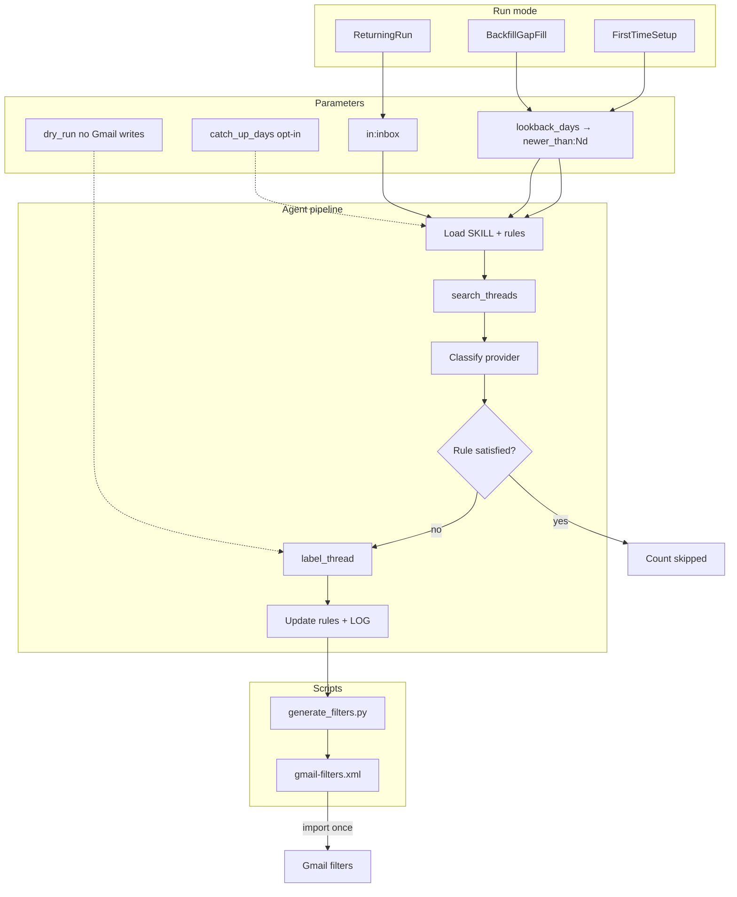

<p align="left">
  <a href="https://buymeacoffee.com/rnlkja"></a>
  <a href="https://www.gnu.org/licenses/gpl-3.0"></a>
</p>

<h1 align='center'>Gmail Labeler</h1>

<p align="center"><strong>Triage your Gmail by provider, with importable filters.</strong></p>

<p align="center">
  
</p>

<p align="center">
  <a href="https://buymeacoffee.com/rnlkja">
    
  </a>
</p>

> ## ⚠️ Important — read before you install
>
> **This skill gives an AI agent access to your Gmail.** That is powerful and
> genuinely risky if you skip the fine print. Please read this section before
> connecting your mailbox.
>
> ### What actually happens to your mail
>
> - Your **agent** (Cursor, Claude, Codex, or similar) uses a **Gmail MCP
>   connector** to search threads, read **sender, subject, snippet, and often
>   message body text**, and apply or remove labels.
> - That content may be sent to the **LLM provider** that powers your agent
>   (OpenAI, Anthropic, etc.), depending on how your tool is configured. **This
>   repository does not control, host, or see your mail.** Only you and your
>   chosen agent stack do.
> - The skill is designed **not** to open attachment contents (PDFs, images,
>   documents). Filenames may still appear in metadata. Treat every run as
>   handling **private data**: receipts, tax notices, health mail, login codes,
>   and personal correspondence.
> - The skill can **add labels**, **create labels**, and **remove the INBOX label
>   (archive)**. It does **not** delete mail, send mail, or mark messages read —
>   but mis-labelling or archiving something you needed in the inbox is still a
>   real failure mode. **Start with `dry_run: true`.**
>
> ### What this project is — and is not
>
> - **Not affiliated with Google or Gmail.** Gmail Labeler is an independent
>   open-source skill (GPL-3.0). Google’s names and products are trademarks of
>   their respective owners.
> - **Not a hosted service.** There is no cloud backend, no account on our
>   servers, and no telemetry in this repo. Your rules live in local files
>   (`MEMORY.md`, `provider-rules.md`, `LOG.md`) that you control.
> - **Not professional advice.** Use at your own discretion. If your inbox
>   contains confidential work mail, legal, medical, or government-sensitive
>   material, consider a **dedicated test account**, strict MCP permissions, or
>   manual filters instead.
> - **No warranty.** Software is provided as-is. The author is not liable for
>   misfiled mail, missed bills, or any loss arising from use of this skill.
>
> ### Before your first live run
>
> 1. Read `SKILL.md` → **Security & data access** and `references/email-policy.md`.
> 2. Run a **dry run** (`examples/prompts/dry-run.md`) and review the plan.
> 3. Confirm you trust your **MCP package**, **agent**, and **model provider**
>    with the mail you put in scope.
> 4. Import `gmail-filters.xml` only after you are happy with the rule table.
>
> **Support via Buy Me a Coffee is voluntary and does not change any of the
> above.** It helps maintain the project; it is not a subscription, a hosted
> service, or an endorsement of how you configure AI access to your inbox.
>
> If this feels like too much access, **do not install the skill.** Manual Gmail
> filters or inbox rules may be a better fit.

<!-- > **Sponsor on GitHub:** use the **Sponsor** button (heart icon) on the repo homepage. It links to [buymeacoffee.com/rnlkja](https://buymeacoffee.com/rnlkja) via [`.github/FUNDING.yml`](.github/FUNDING.yml). -->

## About Gmail Labeler

Gmail Labeler is an agent skill for [Cursor](https://cursor.com), [Claude](https://claude.ai), and [Codex](https://developers.openai.com/codex/) that files your mail by the company or service that sent it. Newsletters, receipts, subscription renewals, bank alerts, and grocery confirmations each land under a nested label (for example `Shopping/Amazon`, `Subscriptions/Spotify`, or `Banking/PayPal`). What stays in your inbox, by design, is the mail that actually needs you: a bill due this week, a government notice, or a message from a real person.

The skill runs through a Gmail MCP connector. Your agent reads sender addresses, subjects, and snippets, matches them to a label taxonomy you control, and applies labels in bulk. Receipts and account records stay visible. Marketing and digests get labelled and archived so they remain searchable without cluttering the inbox. Nothing is deleted. Attachment filenames can be used for context; attachment contents are never opened.

On the first run, the skill follows the **Initial Setup Checklist**
(`references/initial-setup-checklist.md`): **master categories first**, then mail
analysis, then provider children, then apply. Default `lookback_days: 90`. Generates
`gmail-filters.xml` and skips mail that already satisfies the rule. Import filters
once to label older backlog without the agent re-reading every thread. **Returning
runs** triage **inbox only**. Personal rules live in local files (`MEMORY.md`,
`provider-rules.md`, `LOG.md`) that never leave your machine.

## Who this is for

This skill suits you if:

- Your inbox mixes bills, newsletters, order confirmations, and job alerts in one unread pile.
- You already use labels in Gmail (or want to) and prefer filing by provider rather than by date alone.
- You run an AI coding agent with MCP and want repeatable email triage without manual filter setup for every new sender.
- You want a starter rule set (~100 globally recognised brands) that you can customise for your own mailbox.

If you only receive a handful of emails per week and never use labels, manual Gmail filters may be enough. Gmail Labeler pays off when volume is high and senders repeat.

## What you get out of the box

| Deliverable                             | What it does                                                                                       |
| --------------------------------------- | -------------------------------------------------------------------------------------------------- |
| `SKILL.md`                              | Step-by-step method the agent follows on every run                                                 |
| `references/provider-rules.template.md` | Starter sender-to-label table across banking, grocery, subscriptions, travel, bills, and more      |
| `references/email-policy.md`            | Category actions (keep, archive, notify, skip) and safety rules                                    |
| `examples/prompts/`                     | Copy-paste prompts for first-time setup, weekly inbox triage, backfill, dry runs, fix-wrong-labels |
| `examples/minimal/`                     | 10-brand rules file for a quick dry-run                                                            |
| `examples/scheduling/`                  | launchd, cron, and GitHub Actions templates for Sunday triage                                      |
| `scripts/generate_filters.py`           | Deterministic `gmail-filters.xml` generator                                                        |
| `scripts/validate_rules.py`             | Lint `provider-rules.md` before generating filters                                                 |
| Generated `gmail-filters.xml`           | One Gmail import to label existing mail and auto-file future mail                                  |

After setup, a typical inbox drops from hundreds of unread threads to a short list of actionable items, with everything else filed under organised labels in the sidebar.

## How it works



**First-time setup** follows `references/initial-setup-checklist.md`: **Step 1
masters → Step 2 analyse mail → Step 3 provider children → Step 4 apply**. Default
**90-day** lookback. Import filters to handle older mail without a long agent scan.
**Returning runs** process **inbox only** with rule-satisfied skip. See [VERSION.md](VERSION.md).

## Core behaviour

- **Labels mail by provider.** Every recognisable sender gets a nested label (`Shopping/Amazon`, `Subscriptions/Spotify`, `Banking/PayPal`, and so on).
- **Keeps records, archives noise.** Receipts, bills, and government mail stay in the inbox. Newsletters and promos are labelled then archived.
- **Generates importable Gmail filters** via `scripts/generate_filters.py` — re-import when rules change.
- **Parameterised lookback.** Default three months (`lookback_days: 90`). Widen only when you need older history.
- **Token-efficient by design.** Domain dedupe, snippet-only reads, rule-satisfied skip, `max_threads` cap — see `references/token-efficiency.md`.
- **Learns over time.** New senders go in `provider-rules.md`; precedents in `MEMORY.md`; every run logged in `LOG.md`.

## What your Gmail looks like after

**Before:**

```text
INBOX (1,247 unread)
  Spotify Family Plan renewal notice
  TLDR: "5 stories from your day"
  AGL Energy bill is due in 5 days
  Amazon: Your order has shipped
  Booking.com: 30% off your next stay
  ATO: Notice of assessment
  Patreon: Weekly digest from 4 creators
  GitHub: 12 notifications
  ... (1,239 more)
```

Everything competes with everything. The bill and the tax notice sit next to a sale
promo and a digest.

**After:**

```text
INBOX (3)
  AGL Energy bill is due in 5 days       (kept, actionable)
  ATO: Notice of assessment              (kept, government record)
  Mum: dinner Sunday?                    (kept, personal)

Labels (sidebar):
  Banking/
    PayPal, Chase, CommBank, Wise, …
  Bills/
    AGL, Telstra, Optus, …
  Government/
    ATO, Services NSW, ImmiAccount, …
  Shopping/
    Amazon, eBay, Apple, IKEA, …
  Subscriptions/
    Spotify, Netflix, Notion, GitHub, …
  News & Ads/                            (auto-archived)
    TLDR, Morning Brew, Substack, …
  Travel/
    Qantas, Booking.com, Airbnb, …
  Health/
    Bupa, Chemist Warehouse, …
  Career/
    LinkedIn, Seek, …
```

Everything labelled, marketing pre-archived (still searchable, just out of the
way), receipts and bills kept in the inbox as records, and the inbox itself
collapses to the handful of things that actually need you.

## Prerequisites

- An AI agent that loads **skills** and connects to **Gmail via MCP**:
  - **Cursor**
  - **Claude** (Code / Desktop)
  - **Codex** (OpenAI CLI / agent)
- The Gmail connector must support: `search_threads`, `list_labels`, `label_thread`,
  `unlabel_thread`, `create_label` (see `SKILL.md` for details)
- **Python 3** for `scripts/generate_filters.py` (stdlib only)

## Gmail MCP setup (about 5 minutes)

1. **Google Cloud OAuth client** — create a Desktop app OAuth client, download JSON keys.
2. **Save keys** to `~/.gmail-mcp/gcp-oauth.keys.json`.
3. **Add MCP server** to your agent config:
   - **Cursor:** `~/.cursor/mcp.json` — package `@gongrzhe/server-gmail-autoauth-mcp`
   - **Claude Code:** `~/.claude/mcp.json` (same package)
4. **Authenticate:** `npx @gongrzhe/server-gmail-autoauth-mcp auth`
5. **Reload MCP** in your agent and verify with `list_labels`.

**Security:** limit MCP access if your inbox holds confidential mail. Consider a
dedicated Gmail account for automation trials.

## Installation

### Cursor (per-user skill)

```bash
git clone https://github.com/rNLKJA/gmail-labeler.git ~/.cursor/skills/gmail-labeler
```

### Claude Code / Desktop

```bash
git clone https://github.com/rNLKJA/gmail-labeler.git ~/.claude/skills/gmail-labeler
```

### Codex (OpenAI CLI)

User-wide (available in every project):

```bash
git clone https://github.com/rNLKJA/gmail-labeler.git ~/.codex/skills/gmail-labeler
```

Or project-scoped (commit into your repo for the team):

```bash
git clone https://github.com/rNLKJA/gmail-labeler.git .codex/skills/gmail-labeler
```

Restart Codex after installing so it picks up the new skill. You can also install
via the built-in skill-installer: _"Install the skill from
github.com/rNLKJA/gmail-labeler"_.

### Standalone

Clone anywhere and point your agent's instructions at the `SKILL.md` path.

### Initialise working files

These files hold your personal data and are git-ignored:

```bash
cd gmail-labeler
cp MEMORY.template.md MEMORY.md
cp LOG.template.md LOG.md
cp references/provider-rules.template.md references/provider-rules.md
```

## Initial setup checklist

First-time setup **always** follows this order (full detail in
`references/initial-setup-checklist.md`):

| Step | Action                                                               |
| ---- | -------------------------------------------------------------------- |
| 0    | Load `MEMORY.md`, policy, rules; `list_labels`                       |
| 1    | **Create master categories** (all taxonomy masters by default)       |
| 2    | **Analyse mail** — domain dedupe, classify senders, build label plan |
| 3    | **Create provider children** (`Shopping/Amazon`, etc.)               |
| 4    | **Apply labels** + archive noise; keep records in inbox              |
| 5–6  | Save rules, generate and import `gmail-filters.xml`                  |

Masters exist **before** any mail analysis. Never create nested labels before their
master parent.

### Rebuild install package (optional)

After pulling updates:

```bash
./scripts/build-skill.sh
# writes ../email-labeler.skill by default; use --output PATH to override
```

## Parameters

| Parameter       | Default               | Example scope                                 |
| --------------- | --------------------- | --------------------------------------------- |
| `lookback_days` | **`90`** (3 months)   | `newer_than:90d -in:sent -in:chats -in:draft` |
| `catch_up_days` | `7`                   | `has:nouserlabels newer_than:7d …` (opt-in)   |
| `max_threads`   | unlimited             | Cap pagination (suggest **50** for dry runs)  |
| `dry_run`       | `true` on first scope | No Gmail mutations when true                  |

Optional `config.yaml` — copy from `config.yaml.example`. Prompt parameters override the file.

Natural language: _"last 3 months"_ → `lookback_days: 90`. Widen to `365` only if you need a full year.

### Try in 10 minutes

```bash
cp examples/minimal/provider-rules.minimal.md references/provider-rules.md
python scripts/validate_rules.py references/provider-rules.md
python scripts/generate_filters.py references/provider-rules.md --dry-run --log-summary
```

Then paste `examples/prompts/dry-run.md` into your agent with Gmail MCP connected.

### Saving tokens

1. **Keep the default 90-day window** for first-time setup — covers most active senders.
2. **Import `gmail-filters.xml`** with "Apply to existing conversations" so Gmail labels old mail without the agent reading every thread.
3. **Weekly runs use `in:inbox` only** — cheap once filters are in place.
4. **Dry run first** on any new scope before mutating labels.
5. **Backfill with `has:nouserlabels`** instead of re-scanning all mail in a date range.
6. **Domain dedupe** on first-time setup — classify each sender domain once.
7. **`max_threads: 50`** on dry runs to preview without reading the whole mailbox.

## Usage — first run

Paste this into your agent:

```text
Run the gmail-labeler skill in first-time setup mode.
Follow references/initial-setup-checklist.md in order (masters before analysis).
lookback_days: 90
Scope: newer_than:90d -in:sent -in:chats -in:draft
Dry run: true
Goal: Step 1 masters, Step 2 analyse, report Steps 3–4 before applying.
```

Expected output: checklist status per step, distinct domains, masters (Step 1),
provider children (Step 3), rule-satisfied skip count, confirmation before Gmail
mutations.

See also: `examples/prompts/first-time-setup.md`, `references/initial-setup-checklist.md`

## Usage — recurring runs

Weekly triage prompt:

```text
Run the gmail-labeler skill in returning-run mode.
Scope: in:inbox -in:sent -in:chats -in:draft
Dry run: false
Skip rule-satisfied threads. Only label gaps.
```

**Inbox-zero:** if filters pre-archive everything, zero inbox threads is normal.
Use catch-up only when you ask: `has:nouserlabels newer_than:7d …`

See also: `examples/prompts/weekly-triage.md`, `examples/prompts/fix-wrong-labels.md`

## Scheduling (weekly automation)

Three options — pick one:

| Method         | File                                                                | When                         |
| -------------- | ------------------------------------------------------------------- | ---------------------------- |
| macOS launchd  | `examples/scheduling/launchd/com.rNLKJA.gmail-labeler.weekly.plist` | Sundays 09:00 local          |
| cron           | `examples/scheduling/cron/crontab.example`                          | Sundays 09:00                |
| GitHub Actions | `examples/scheduling/github-actions/weekly-triage.yml`              | Sundays 09:00 UTC (advanced) |

Each file notes the assumptions it makes (CLI binary, env vars, MCP endpoint).
You need a working agent CLI (`cursor-agent`, `claude`, `codex`, or equivalent) on PATH.

**macOS launchd checklist:**

1. Copy `examples/scheduling/launchd/com.rNLKJA.gmail-labeler.weekly.plist` to `~/Library/LaunchAgents/`.
2. Replace `REPLACE_ME` in `StandardOutPath` / `StandardErrorPath` with your username.
3. Confirm `cursor-agent` (or your CLI) is on PATH for non-interactive runs.
4. Test manually: `cursor-agent run --skill gmail-labeler --prompt-file ~/.cursor/skills/gmail-labeler/examples/prompts/weekly-triage.md`
5. Load: `launchctl load ~/Library/LaunchAgents/com.rNLKJA.gmail-labeler.weekly.plist`
6. Logs append to `~/Library/Logs/gmail-labeler.log` — rotate or truncate periodically.

## Troubleshooting

| Symptom                           | Likely cause                  | Fix                                                           |
| --------------------------------- | ----------------------------- | ------------------------------------------------------------- |
| OAuth / MCP auth fails            | Missing `gcp-oauth.keys.json` | [Gmail MCP setup](#gmail-mcp-setup-about-5-minutes)           |
| `validate_rules.py` errors        | Typo in rules table           | Fix `Domain` / `Default` / duplicate rows; re-run validator   |
| 0 threads on returning run        | Filters working; inbox empty  | Expected for inbox-zero; use catch-up only when you ask       |
| Duplicate filters after re-import | Gmail merges by criteria      | Delete old filters in Gmail or diff XML before import         |
| Wrong labels on PayPal merchants  | One domain, many merchants    | Use fix-wrong-labels mode; `content_type` + subject in rules  |
| Generator "no rules parsed"       | Empty or malformed table      | Ensure `\| Domain \|` header and rows before `## Always skip` |
| CI / version mismatch             | SKILL vs VERSION.md drift     | Keep frontmatter `version:` in sync with `VERSION.md`         |

## Optional regional packs

Copy sections from `templates/taxonomy-au.md` or `templates/taxonomy-us.md` into
`MEMORY.md` or `references/provider-rules.md` when your mailbox is AU- or US-centric.
They are examples only — not loaded automatically.

## Files

| File                                    | Purpose                                                 |
| --------------------------------------- | ------------------------------------------------------- |
| `SKILL.md`                              | The method — read first by the agent (v1.3.1)           |
| `README.md`                             | This file                                               |
| `VERSION.md`                            | Feature matrix and current version                      |
| `CHANGELOG.md`                          | Release history                                         |
| `CONTRIBUTING.md`                       | How to contribute and run local checks                  |
| `LICENSE`                               | GPL-3.0                                                 |
| `scripts/generate_filters.py`           | Rules → `gmail-filters.xml` + `email-receive-rules.md`  |
| `scripts/validate_rules.py`             | Lint provider rules before generation                   |
| `scripts/build-skill.sh`                | Rebuild `email-labeler.skill` zip                       |
| `references/run-modes.md`               | Run modes, parameters, fix-wrong-labels                 |
| `references/initial-setup-checklist.md` | First-time setup checklist (masters before analysis)    |
| `references/token-efficiency.md`        | Domain dedupe, max_threads, filter strategy             |
| `references/email-policy.md`            | Category actions and safety rules                       |
| `references/provider-rules.template.md` | Starter sender→label table (~200 rules)                 |
| `templates/taxonomy-au.md`              | Optional AU regional taxonomy                           |
| `templates/taxonomy-us.md`              | Optional US regional taxonomy                           |
| `config.yaml.example`                   | Optional run defaults                                   |
| `MEMORY.template.md`                    | Scaffold for account-specific precedents                |
| `LOG.template.md`                       | Scaffold for run history                                |
| `examples/prompts/`                     | First-time, weekly, backfill, dry-run, fix-wrong-labels |
| `examples/minimal/`                     | 10-brand quickstart rules                               |
| `examples/scheduling/`                  | launchd, cron, GitHub Actions templates                 |

Working copies (`MEMORY.md`, `LOG.md`, `references/provider-rules.md`) are
created locally and git-ignored.

## Security & privacy

### What this skill accesses

This skill reads your email — sender, subject, snippet, body text, label IDs,
and attachment **filenames** — to decide what label to apply. It does **not**
download, open, or read attachment contents. It does **not** send, reply,
forward, or delete mail. It only changes labels (including removing `INBOX` to
archive).

|              | Reads                                                           | Modifies                                                |
| ------------ | --------------------------------------------------------------- | ------------------------------------------------------- |
| **CAN**      | Sender, subject, snippet, body, label IDs, attachment filenames | Add labels, remove INBOX, create labels                 |
| **MUST NOT** | Attachment contents (PDFs, images, docs)                        | UNREAD, STARRED, content, recipients; send/reply/delete |

### Local personal data

`MEMORY.md`, `LOG.md`, and the populated `references/provider-rules.md` contain
your personal sender list and precedents. They are listed in `.gitignore` and
never committed. If you fork this repo, keep the same `.gitignore`.

The skill itself only calls your Gmail MCP connector and writes to local files.
Anything beyond that boundary depends on your chosen MCP and agent runtime.

## Customising

- Edit `MEMORY.md` for account-specific precedents (parent taxonomy, keep/archive
  rules, multi-type brand splits).
- Edit `references/provider-rules.md` for your sender→label map (include `Match` for multi-type brands).
- Edit `references/email-policy.md` to adjust category actions.
- Regenerate filters after rule changes:

```bash
python scripts/validate_rules.py references/provider-rules.md
python scripts/generate_filters.py references/provider-rules.md --output-dir . --log-summary
```

Re-import `gmail-filters.xml` in Gmail when the run report or LOG rule count changes.

## Contributing

See [CONTRIBUTING.md](CONTRIBUTING.md). Issues and pull requests welcome. This project is licensed under GPL-3.0 — if you
build on top of it, your derivative work must also be released under GPL-3.0.

## License

GPL-3.0 — Copyright (C) 2026 rNLKJA. See [LICENSE](LICENSE).

If you build on top of this repo, your derivative work must also be released under
GPL-3.0.

## Support

<p align="center">
  <a href="https://buymeacoffee.com/rnlkja">
    
  </a>
</p>

If this skill saves you time, a coffee helps keep it maintained. Visit [buymeacoffee.com/rnlkja](https://buymeacoffee.com/rnlkja) or use the **Sponsor** button on this repo.
